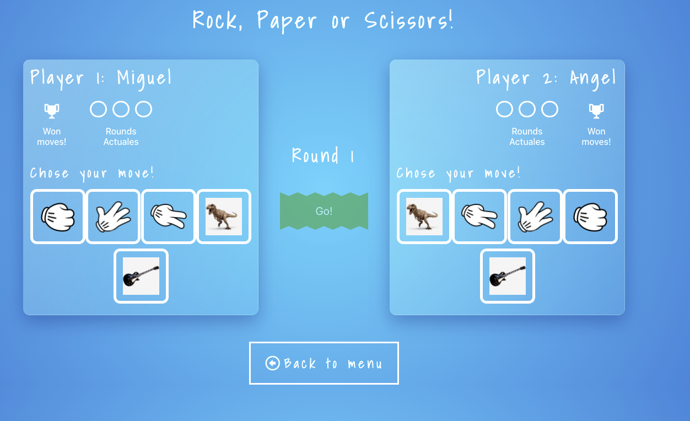
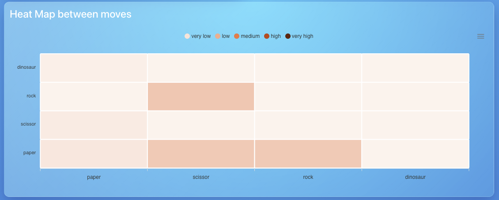

**This is the Back of the Game made in Nodejs and Express**

Once you download this project, you just to run these command lines.

to install node_modules
- npm install

And then to run the front
- npm start

This is what it looks like

 

**End Points**

The player's endpoints are the next, and they are executed on realtime during the game.
take note that you have to put a parameter on this.

http://localhost:4000/api/stats/player/:id/matches-won
http://localhost:4000/api/stats/player/:id/most-used-moves

And the statistics endpoints about the game are these, you can just execute them without parameters.

http://localhost:4000/api/stats/games/most-picked-move-first-game
http://localhost:4000/api/stats/games/average-time
http://localhost:4000/api/stats/matches/average-quantity-takes-to-complete
http://localhost:4000/api/stats/matches/percentage-complete-incomplete
http://localhost:4000/api/stats/matches/matrix

El endpoint extra que se agregó es para poblar una estadística expresada en un mapa de calor, el cual se ven las combinaciones de jugadas hechas por cada match:

 

Enjoy. :smirk:
